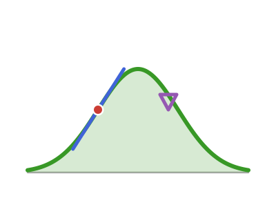

# EpiAwareADTools 

<!-- badges:start -->
| **Documentation** | **Build Status** | **Code Quality** | **License & DOI** | **Downloads** |
|:-----------------:|:----------------:|:----------------:|:-----------------:|:-------------:|
| [](https://epiawareadtools.epiaware.org/stable/) [](https://epiawareadtools.epiaware.org/dev/) | [](https://github.com/EpiAware/EpiAwareADTools.jl/actions/workflows/test.yaml) [](https://codecov.io/gh/EpiAware/EpiAwareADTools.jl) [](https://github.com/EpiAware/EpiAwareADTools.jl/actions/workflows/ad.yaml) | [](https://github.com/SciML/SciMLStyle) [](https://github.com/JuliaTesting/Aqua.jl) [](https://github.com/aviatesk/JET.jl) | [](https://opensource.org/licenses/MIT) | [](https://juliapkgstats.com/pkg/EpiAwareADTools) [](https://juliapkgstats.com/pkg/EpiAwareADTools) |

| ForwardDiff | ReverseDiff (tape) | Enzyme forward | Enzyme reverse | Mooncake reverse | Mooncake forward |
|:---:|:---:|:---:|:---:|:---:|:---:|
| [](https://app.codecov.io/gh/EpiAware/EpiAwareADTools.jl?flags%5B0%5D=ad-forwarddiff) | [](https://app.codecov.io/gh/EpiAware/EpiAwareADTools.jl?flags%5B0%5D=ad-reversediff) | [](https://app.codecov.io/gh/EpiAware/EpiAwareADTools.jl?flags%5B0%5D=ad-enzyme-forward) | [](https://app.codecov.io/gh/EpiAware/EpiAwareADTools.jl?flags%5B0%5D=ad-enzyme-reverse) | [](https://app.codecov.io/gh/EpiAware/EpiAwareADTools.jl?flags%5B0%5D=ad-mooncake-reverse) | [](https://app.codecov.io/gh/EpiAware/EpiAwareADTools.jl?flags%5B0%5D=ad-mooncake-forward) |
<!-- badges:end -->

Automatic-differentiation safety machinery for the EpiAware modelling stack.

## Why EpiAwareADTools?

EpiAwareADTools is the EpiAware org's shared home for AD-safety machinery and AD
workarounds.
It is deliberately framed as fixes we host while we try to fix things upstream:
every entry is documented with the upstream package or issue where it ideally
belongs, and each is deleted once that upstream fix lands.

Two families make up the current surface.

- The tape-strip pair `primal` and `primal_distribution` reduce an AD-wrapped
  scalar or distribution to its underlying primal, keeping a non-differentiable
  hyperparameter (an integration window, a clamp location) off the AD path on
  every backend.
- The AD-safe evaluation hooks `cdf_ad_safe`, `logcdf_ad_safe`, `ccdf_ad_safe`,
  `logccdf_ad_safe`, and `pdf_ad_safe` are extension points a wrapper package
  overloads for its own component types.
  Their `Gamma` methods route through an analytic gamma-CDF derivative that
  stands in for the differentiability `SpecialFunctions.gamma_inc` leaves
  unimplemented, and their `Beta` methods do the same for
  `SpecialFunctions.beta_inc`'s missing shape-parameter derivatives.

Per-backend behaviour for ForwardDiff, ReverseDiff, Enzyme, Mooncake, and
ChainRulesCore is supplied by package extensions loaded when each backend is
present.

## Getting started

See the [documentation](https://epiawareadtools.epiaware.org/stable/) for a
full walkthrough.

```julia
using EpiAwareADTools, Distributions

# AD-safe Gamma CDF, differentiable in shape/scale on every supported backend.
cdf_ad_safe(Gamma(2.0, 1.0), 3.0)

# Strip an AD wrapper back to its primal value.
primal(3.0)
```

## Related packages

- [ConvolvedDistributions.jl](https://convolveddistributions.epiaware.org/stable/), [ComposedDistributions.jl](https://composeddistributions.epiaware.org/dev/), [ModifiedDistributions.jl](https://modifieddistributions.epiaware.org/dev/), [LoweredDistributions.jl](https://lowereddistributions.epiaware.org/dev/) and [CensoredDistributions.jl](https://censoreddistributions.epiaware.org/stable/) import these AD-safe hooks in their own source and overload them for their component types, so their densities differentiate on every supported backend.
- [DistributionsInference.jl](https://github.com/EpiAware/DistributionsInference.jl) is the emerging fit-protocol layer across those packages, where the AD-safety this package provides is what makes gradient-based fitting work.

## Where to learn more

- Want to get started running code? Check out the [Getting started documentation](https://epiawareadtools.epiaware.org/stable/getting-started/).
- Want to understand the API? Check out our [API reference](https://epiawareadtools.epiaware.org/stable/lib/public).
- Want to contribute to `EpiAwareADTools`? Check the [open issues](https://github.com/EpiAware/EpiAwareADTools.jl/issues) and the Contributing section below.
- Want to see our code? Check out our [GitHub Repository](https://github.com/EpiAware/EpiAwareADTools.jl).

## Getting help

For usage questions, ask on the [Julia Discourse](https://discourse.julialang.org)
(the SciML or usage categories) or the [epinowcast community forum](https://community.epinowcast.org),
our home for epidemiological modelling questions.
Please use [GitHub issues](https://github.com/EpiAware/EpiAwareADTools.jl/issues)
for bug reports and feature requests only.

## Contributing

We welcome contributions and new contributors! This package follows [ColPrac](https://github.com/SciML/ColPrac) and the [SciML style](https://github.com/SciML/SciMLStyle).

## Supporting and citing

If you would like to support EpiAwareADTools, please star the repository — such metrics help secure future funding.

If you use EpiAwareADTools in your work, please cite it:

```bibtex
@software{EpiAwareADTools_jl,
  author       = {Sam Abbott and EpiAware contributors},
  title        = {EpiAwareADTools.jl},
  year         = {2026},
  url          = {https://github.com/EpiAware/EpiAwareADTools.jl}
}
```

A citable DOI will be added with the first tagged release.

## Code of conduct

Please note that the EpiAwareADTools project is released with a [Contributor Code of Conduct](https://github.com/EpiAware/.github/blob/main/CODE_OF_CONDUCT.md). By contributing, you agree to abide by its terms.
